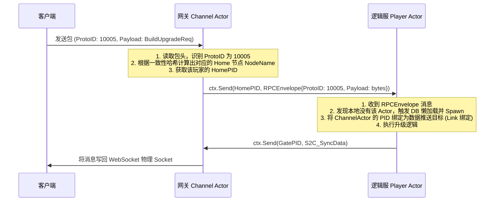
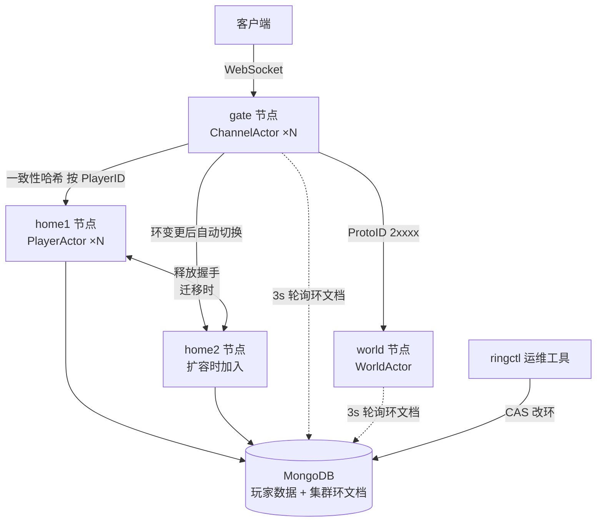

# SLG Game Server Infrastructure Blueprint
# SLG 游戏服务器底层基础建设与路由设计蓝图 (最终版)

本蓝图专注于游戏服务器的**底层网络、连接管理、网关路由、跨进程通信以及集群架构**，不涉及任何游戏具体业务。此版本已完全同步通过交互确认的各项决策，采用 **“全 Actor 闭环架构”**，整个集群的通信、断线清理、以及多播事件广播（聊天、大地图 AOI）全部使用 `ergo` 原生机制实现。

> 分布式集群设计（三层职责分离、在线扩缩容、epoch 写入围栏、故障韧性）见 **§8** 总览，
> 完整推导与实证记录见 [docs/scaling-design.md](docs/scaling-design.md)。

---

## 1. 基础建设技术栈与决策决策矩阵

根据设计讨论，本项目的底层核心技术栈及决策如下：

| 维度                | 决策方案                             | 实施细节与理由                                                                                                                                            |
|:------------------|:---------------------------------|:---------------------------------------------------------------------------------------------------------------------------------------------------|
| **客户端长连接**        | **WebSocket (裸连接)**              | 开发调试阶段直接使用裸 WS 协议。后续生产环境通过 Nginx 挂载 SSL 证书统一提供 **WSS** 支持，业务层无需编写证书及加解密逻辑。                                                                         |
| **集群注册与发现**       | **ergo 内嵌 registrar (host:4499)**   | **不依赖外部 etcd/Consul，也无需静态路由配置**。同机首个进程绑定 4499 担任 registrar server，其余进程自动注册；节点间按节点名现场解析监听端口（跨机先 DNS 解析 host，k8s 上节点名改用 Service DNS 名零代码适配）。 |
| **网关连接模型**        | **Channel Actor (每个连接一个 Actor)** | **全 Actor 闭环**。网关为每个 Socket 派生一个 `Channel Actor`。通过 `ergo` 的 **Link (双向生死绑定)** 机制，Socket 断开时自动促使后端 `Player Actor` 退出，完全消除下线清理逻辑。                   |
| **网关到节点路由**       | **一致性哈希 + Mongo 环文档**       | `Channel Actor` 通过 `PlayerID` 本地一致性哈希定位 `Home` 节点。哈希环节点列表以 **Mongo 单文档为唯一真相源**（CAS 乐观锁改环 + 三方 3s 轮询热切），支持不停服在线扩缩容，详见 §8。                                         |
| **玩家 Actor 生命周期** | **惰性加载 + 超时自动销毁**                | 消息第一次路由到节点时，如果内存中没有该玩家，则自动触发 DB 读取并 Spawn Actor；若玩家持续 10 分钟没有消息交互，则自动数据写回 DB 并销毁 Actor，释放内存。                                                       |
| **数据持久化策略**       | **异步写回 + epoch 围栏 + 失败重试**               | 常规操作内存即时修改，每 5 秒脏字段级**异步批量写回 MongoDB (Write-Back)**；所有落盘携带 epoch 写入围栏防旧主脏写；失败批次指数退避回投重试（Mongo 短时停机增量零丢失，已故障注入实证）。充值等高价值操作后续接入同步写入 (Write-Through)。                                                |
| **大地图加载策略**       | **空间 Cell 惰性加载 + Chunk 级读写**     | 大地图划分成多个 `Cell`，Cell 内部由 `Chunk` 组成。Cell Actor 仅在所属 Chunk 活跃时，从 DB 懒加载对应的 `Chunk` 动态状态；闲置时按 Chunk 刷入 DB 并卸载。                                       |
| **地图视野同步 (AOI)**  | **ergo 原生分布式事件总线 (Pub/Sub)**     | **不需手写广播过滤**。每个 `Cell Actor` 为其管理的 Chunk 注册一个 `ergo` 原生事件（Event）。网关 `Channel Actor` 订阅视口覆盖的 Chunk Event。Cell 内有变动时直接 `Publish`，由 `ergo` 底层自动跨节点多播。 |
| **状态同步机制**        | **增量脏同步 + AOI 事件推送**             | 个人数据使用**脏标记 (Dirty Flags)** 机制，在请求结束时统一打包增量变更（命名为 **S2C_SyncData**）推送给客户端；大地图数据由 `Cell Actor` 触发变更，网关按 Chunk 订阅列表多播分发。                             |
| **高并发定时器**        | **本地时间轮 + Redis ZSet 备份**        | 每个逻辑节点独立运行内存分层时间轮（Timing Wheel）驱动定时器。关键事件（如行军到达）同步备份在外部 Redis 的 `ZSet` 中，防止宕机丢失。                                                                   |

---

## 2. 客户端 ↔ 网关 通信协议与包体设计

为了防止粘包、半包、恶意大包攻击，客户端与网关之间采用 **Header-Length 二进制流格式**：

```text
┌───────────────────┬───────────────────┬───────────────────┬───────────────────┐
│ Length (4 bytes)  │  ProtoID (4 bytes)│   SeqID (4 bytes) │  Payload (Bytes)  │
├───────────────────┼───────────────────┼───────────────────┼───────────────────┤
│    整个包的长度     │    Protocol ID    │   客户端包序列号   │   Protobuf 数据   │
└───────────────────┴───────────────────┴───────────────────┴───────────────────┘
```

*   **Length (4字节)**：标识紧随其后的包体总长度。网关读取时，先读 4 字节，若超过设定的最大包大小（如 64KB），则判定为恶意攻击，直接断开连接。
*   **ProtoID (4字节)**：协议号。用于标识该消息是什么业务协议，并决定网关将其路由到哪个节点。
*   **SeqID (4字节)**：递增的序列号。用于网关进行防重放攻击、防作弊、丢包重传校验。
*   **Payload**：由对应 `ProtoID` 定义的 Protobuf 序列化二进制数据。

---

## 3. 网关连接管理与 Session 设计

网关为每一个客户端连接 Spawn 一个本地的 `Channel Actor`。

### 3.1 Channel Actor 状态数据 (State)
每个 `Channel Actor` 在内存中维护该连接的所有 Session 状态：

```go
type ChannelState struct {
    ConnID     int64          // 连接唯一ID
    PlayerID   string         // 玩家ID（未登录前为空）
    WSConn     *websocket.Conn// 底层 WebSocket 连接对象
    HomePID    gen.PID        // 该连接对应的后端 Home 服 Player Actor PID
    WorldPID   gen.PID        // 该连接对应的后端 World 服 Cell Actor PID
    LastHeart  time.Time      // 上次收到心跳的时间
    AuthStatus bool           // 是否通过 Token 认证
}
```

---

## 4. 网关 ↔ 后端节点路由机制 (Routing Logic)

由于采用了全 Actor 闭环架构，跨进程的路由、封包、网络传输完全由 `ergo` 的消息总线接管，业务层无需编写任何网络路由连接代码。

### 4.1 协议号范围划分 (Protocol Partitioning)
网关解析客户端发来的包头中的 `ProtoID`，根据区间直接路由：

```text
[ProtoID 范围]       ──────►  [路由去向]
1000 - 9999         ──────►  Gate 本地处理 (如 Login, Heartbeat, Reconnect)
10000 - 19999       ──────►  Home 逻辑服 (个人数据, 建筑升级, 抽卡)
20000 - 29999       ──────►  World 地图服 (大地图行军, 采集, 侦察)
30000 - 39999       ──────►  Alliance 联盟服 (联盟帮助, 集结战争)
```

### 4.2 路由流程演示：玩家请求建筑升级 (`ProtoID: 10005`)



---

## 5. 数据状态同步机制 (State Synchronization)

为了确保高吞吐量与极低带宽消耗，游戏状态同步采取以下两种不同设计：

### 5.1 个人内政增量脏同步 (Home ↔ Client)
*   **脏标记存储**：玩家 Actor (Player Actor) 在内存中维护各个子模块的数据版本号或 `isDirty` 标记。
*   **同步协议 (S2C_SyncData)**：
    1.  当玩家请求某操作（如扣除资源、消耗道具）时，Player Actor 内部修改对应模块数据，并设置 `module.isDirty = true`。
    2.  在当前消息处理器（`HandleCall` 或 `HandleCast`）返回之前，Player Actor 执行一个公共拦截函数：
        *   检查所有子模块的 `isDirty` 标记。
        *   将所有标记为脏的模块的增量更新（例如：`Gold: 1000`，`Item[102]: count-1`）统一打包进一个 **`S2C_SyncData`** 消息包。
        *   通过 `ctx.Send(GatePID, S2C_SyncData)` 发送给网关。
        *   网关的 `Channel Actor` 收到后写回 Socket。

### 5.2 大地图 AOI 区块多播推送 (Cell ↔ Gate ↔ Client)
*   **大地图空间划分 (类似 BigWorld)**：
    *   **Map (全图)**：例如 1200x1200 格。
    *   **Cell (计算边界)**：由 `Cell Actor` 驱动（线程与协程隔离边界），面积较大（如 240x240 格）。
    *   **Chunk (加载与广播边界)**：逻辑分块（如 30x30 格）。
    *   **Tile (格子)**：大地图上最小的 2D 坐标单位（1x1），存储具体地形和实体指针。
*   **基于 ergo 原生事件总线 (Pub/Sub) 的视野广播机制**：
    1.  `Cell Actor` 启动时，为其管理的每个活跃 Chunk 注册一个 `ergo` 原生事件（例如调用 `ctx.RegisterEvent(eventChunkID, options)`）。
    2.  当玩家滑动屏幕，客户端发出视角移动消息时，网关的 `Channel Actor` 计算出当前覆盖的多个 Chunk ID，并调用 `ctx.LinkEvent(CellPID, eventChunkID)` 来订阅这些区块。当视角移开时，调用 `ctx.UnlinkEvent` 退订。
    3.  当 Chunk 内发生任何属性修改或行军变动时，`Cell Actor` 直接将事件数据 `Publish` 广播到对应的 `eventChunkID` 上。
    4.  `ergo` 底层网络层会自动检索并跨节点，把该事件多播分发给所有订阅了此事件的网关 `Channel Actor`，再由其写回客户端。
*   **优势**：网关层不用编写广播过滤代码，业务层（Cell Actor）不需要知道具体连接，完美解耦，全部由 `ergo` 高性能多播分发。

---

## 6. 跨节点 RPC RPCEnvelope 定义

为了实现高性能且类型安全的跨节点通信，我们定义一个统一的 RPC 传输外壳。

```protobuf
syntax = "proto3";
package api;

// 跨物理进程传输的消息外壳
message RPCEnvelope {
    int64  session_id = 1; // 网关的 Session ID
    string player_id  = 2; // 玩家唯一 ID
    int32  proto_id   = 3; // 实际业务协议号
    bytes  payload    = 4; // 实际业务协议的二进制数据（如 BuildUpgradeReq）
}
```

---

## 7. 基于 golang-standards/project-layout 规范的脚手架设计

为确保项目的标准化，防止代码重构混乱，项目目录架构严格按照官方规范进行如下规划：

```text
overmind/
├── api/                   # [标准] 存放接口定义文件与生成的客户端/服务端存根
│   ├── rpc/               # 内部节点 RPC 协议 (.proto 协议及生成的 Go 代码)
│   │   ├── rpc.proto
│   │   └── rpc.pb.go
│   └── game/              # 客户端 ↔ 服务端 协议 (.proto 及生成的 Go 代码)
│       └── game.proto
│
├── cmd/                   # [标准] 主入口目录。每个子文件夹编译后产生对应的可执行文件
│   ├── gate/              # 网关服主启动器
│   │   └── main.go
│   ├── home/              # 玩家逻辑服主启动器
│   │   └── main.go
│   └── world/             # 大地图服主启动器
│       └── main.go
│
├── internal/              # [标准] 私有库代码，存放不希望被外部项目导入的核心代码
│   ├── app/               # 各节点专属的内部运行逻辑与 Actor 行为实现
│   │   ├── gate/          # 网关的 Connection 循环和一阶路由逻辑
│   │   ├── home/          # Player Actor 行为与 MongoDB 数据库交互实现
│   │   └── world/         # Cell Actor 及大地图空间行军、AOI 广播逻辑
│   │
│   └── pkg/               # 各节点共享的私有基础库 (框架 SDK 所在地)
│       ├── actor/         # 基于 ergo 的 Actor 行为包装与 RPC 传输外壳收发辅助
│       ├── network/       # TCP/WS 网关底层网络封装、Length-Header 封包与 Session 管理
│       ├── timer/         # 高性能分层时间轮 (Timing Wheel) 实现
│       └── chunk/         # 地图 Chunk 序列化及数据存储加载引擎
│
├── configs/               # [标准] 存放各节点的配置文件（如 YAML / JSON）
│   ├── gate.yaml
│   ├── home.yaml
│   └── world.yaml
│
├── scripts/               # [标准] 编译、自动代码生成 (如 protoc-gen-go) 等脚本文件
│   └── gen_proto.sh
│
├── go.mod
└── Makefile
```

---

## 8. 分布式集群设计 (Distributed Cluster Design)

> 完整推导、时序图与实证记录见 [docs/scaling-design.md](docs/scaling-design.md)，本节是总览。

### 8.1 设计哲学：反中心化 + 三层职责分离

集群不存在任何中心协调进程（无 Akka ShardCoordinator 式 singleton），事实源全部下放，
三层各自独立、互不信任：

| 层 | 职责 | 实现 | 裁决权 |
|---|---|---|---|
| **寻址层** | 节点名 → 监听端口 | ergo 内嵌 registrar (host:4499) + DNS | 无（纯电话簿，Erlang EPMD 血统） |
| **成员层** | 哪些节点在环上 | Mongo 单文档 (CAS 乐观锁) + ringctl 工具 + 三方 3s 轮询热切 | 唯一裁决者（Orleans membership table 同源思路） |
| **安全层** | 防脏写 | epoch 写入围栏（落盘 filter 携带任期号） | 不信任上两层，落盘时独立裁决（fencing token） |

关键推论：**即使路由错了、环视图不一致、节点假死复活，DB 也不会被写脏**——正确性不依赖任何进程活着或任何视图同步。

### 8.2 静态拓扑



### 8.3 在线扩缩容（不停服、玩家无感）

扩容：起新 home 进程（零路由配置）→ `ringctl add` → 三方 3s 内热切新环 →
玩家下一条消息路由到新归属节点，触发**惰性迁移**：

1. **释放握手**：新归属节点反查 prev 环找到旧主，请其落盘退位（超时链 15s>10s>8s 对齐，旧节点宕机则超时兜底继续）
2. **抢占所有权**：原子递增 epoch，从此旧主迟到写入全部被围栏作废
3. **惰性激活**：从 DB 读完整数据 Spawn Actor，客户端无感继续

缩容对称：`ringctl remove` → 玩家反向迁回存留节点 → 退役节点排空后优雅停机。
两个方向均已端到端剧本实证（同一条 WS 连接不断，跨节点升级数据连续）。

### 8.4 故障韧性（已故障注入实证项标 ✓）

| 故障场景 | 系统行为 |
|---|---|
| Mongo 短时停机 ✓ | 路由持旧环继续服务；落盘失败批次指数退避回投重试，恢复后增量零丢失 |
| 旧归属节点宕机 | 释放握手超时兜底，新节点照常接管（最坏丢 ≤5s 未落盘增量） |
| 节点假死复活/环视图不一致 | gate 每包归属校验拒转发；home guard 拒接管非自己的玩家；迟到落盘被围栏作废 |
| 节点宕机摘环 | **故意不做自动 failover**：人工 `ringctl remove`（反中心化决策，避免误判险于宕机） |

### 8.5 数据一致性保证

- **不脏**：任何故障组合下 DB 不会被旧主脏写（epoch 围栏 + 每包归属校验双保险）
- **不丢**：Mongo 抖动/停机期间增量回投重试零丢失；仅节点崩溃丢 ≤5s 异步窗口（设计权衡）
- **可重试**：围栏保证重试永远安全——迟到重试要么落自己 epoch 成功，要么被新主围栏作废

### 8.6 验证剧本

| 剧本 | 覆盖路径 |
|---|---|
| `run_test.ps1` | 登录/升级/脏同步/断线重连/超时卸载落盘 |
| `scripts/run_scale_test.ps1` | 在线加节点 + 惰性迁移 + 释放握手 |
| `scripts/run_shrink_test.ps1` | 在线减节点 + 反向迁回 + 退役防呆 |
| `chaos_savefail.ps1` | 故障注入：Mongo 停机 → 落盘重试 → 恢复后增量完整落地 |
